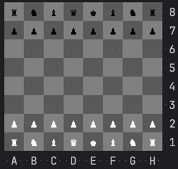
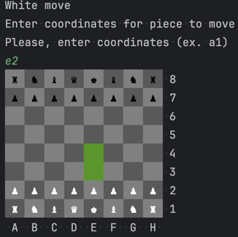
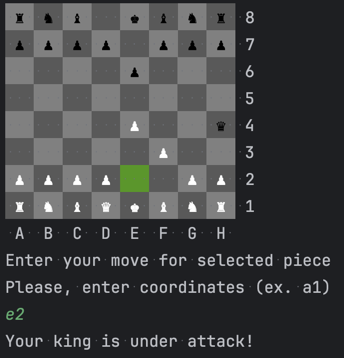
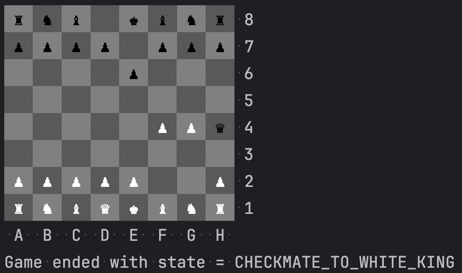

<h1>Шахматы</h1>

Реализация в ООП стиле, с некоторыми допущениями, касательно правил игры.

1. Стартовая позиция шахмат: 

2. Варианты возможных ходов выбранной фигуры:

3. При попытке сделать ход D1-E2, когда король находится по шахом - сообщение:

4. Вывод сообщения о финале игры:
5. 

